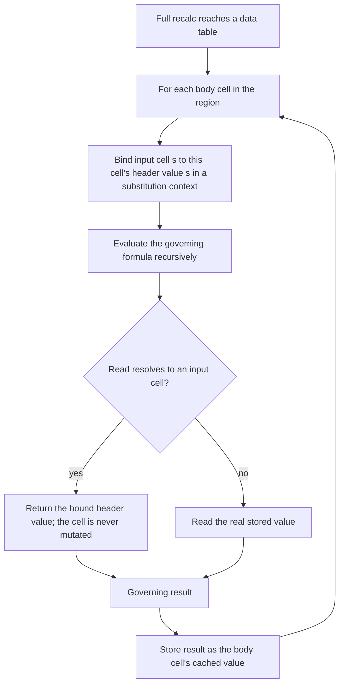
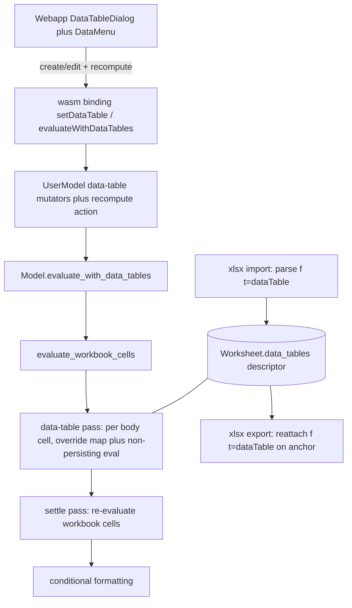
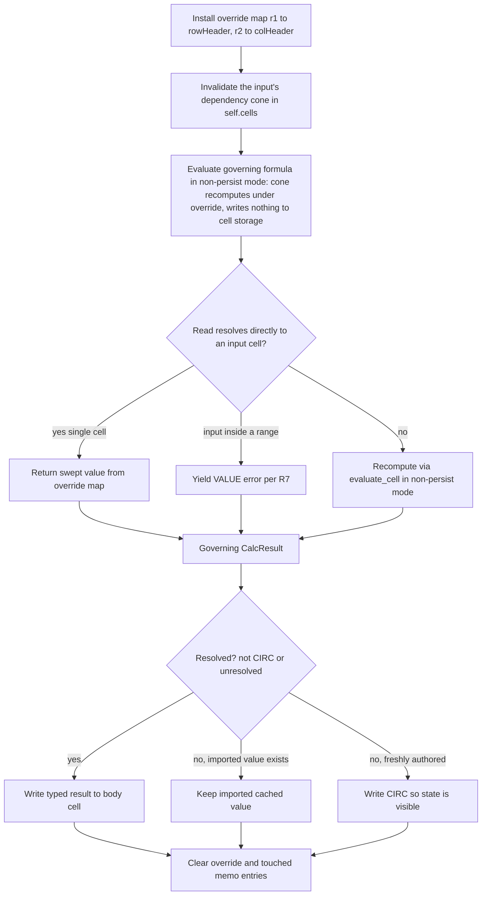

# Data Tables (What-If Analysis) - Plan

## Goal Capsule

- **Objective:** Add Excel **Data Tables** (what-if analysis / "multiple operations") to IronCalc as a first-class, calculable, round-trippable, and authorable feature, designed to merge upstream. This plan's standalone delivered value is the upstream feature, l123, and correct computation on non-circular models; VEEV's headline sensitivity tables in Baba remain blocked until the iterative-calculation plan (002) ships (see Open blockers).
- **Product authority:** Duane Moore (duane.moore@realcdt.com). Driving consumers: Baba (investment-research app) and l123 (Lotus 1-2-3 clone); intended to benefit all IronCalc users via upstream contribution.
- **Open blockers:** Iterative calculation is a hard dependency for VEEV and is scoped to a separate prerequisite plan (`docs/plans/2026-06-27-002-feat-iterative-calculation-seed.md`). Until it ships, VEEV's data-table outputs remain `#CIRC!` — so this plan does not, on its own, make VEEV compute in Baba. It does not block this plan's core delivery (engine, round-trip, bindings, webapp, non-circular validation).
- **Execution profile:** Deep, cross-crate — `base` (engine), `xlsx` (round-trip), `bindings/{wasm,python,nodejs}`, and `webapp`. Implement on a **new branch off `main`**; the `data_table_first_attempt` branch is a reference only and is not built upon.
- **Stop conditions:** Surface a genuine blocker (a scope change or a contradiction with this plan) rather than guessing. VEEV's circular outputs staying `#CIRC!` is expected behavior pending the iterative-calc plan, not a failure.

---

## Product Contract

### Summary

Implement Excel data tables in IronCalc end to end: an engine that computes 1-variable, 2-variable, and multi-output tables by *reference redirection* (substituting input-cell reads during evaluation without mutating any cell), faithful `.xlsx` import **and** export of the data-table descriptor, integration through `UserModel` and the language bindings, and a webapp authoring dialog. The work keeps the proven foundation from the `data_table_first_attempt` branch (descriptor model, import parsing, the split `evaluate()`) and replaces only its fragile mutate-restore compute core.

### Problem Frame

IronCalc cannot compute data tables today — `.xlsx` import rejects them outright (`xlsx/src/import/worksheets.rs:1040` returns `NotImplemented`), and there is no `TABLE` engine concept. Data tables are the standard mechanism for spreadsheet sensitivity analysis: sweep one or two input cells across a grid of values and tabulate how a downstream formula responds. The VEEV template — a real equity-research DCF model targeted for Baba — relies on three of them on its `Model_SENS` sheet to show share-price and IRR sensitivity to revenue growth, exit multiple, and EBITDA margin. Without engine support, that model can be read and written but not recalculated, so it cannot be hosted in IronCalc-backed apps.

The `data_table_first_attempt` branch already computes data tables correctly for several forms, but it computes by physically writing each swept value into the input cell, recomputing, and restoring it. That transient mutation of document state is the root of its known weaknesses and is the kind of pattern upstream reviewers resist. It also never wrote the table back on export and was never wired into the user-facing model.

### Key Decisions

- **Reference redirection, not mutate-restore.** Compute each body cell by redirecting reads of the input cell(s) to the swept value while the governing formula is being evaluated; never write the input cell. This eliminates the state-corruption bug class and is the technique LibreOffice validated. Note that IronCalc caches evaluated cells and persists results into cell storage, so the input's fan-out is *not* re-derived for free: redirection requires a substitution-scoped, non-persisting evaluation that recomputes the input's dependency cone per body cell without polluting the normal cache. LibreOffice achieves this clean scoping via a dedicated dirty-flag subtree that IronCalc does not have (see the cache-scoping gating risk in Dependencies / Assumptions). It reuses the first attempt's descriptor model, import parsing, and `evaluate()` split, replacing only the compute core.
- **Descriptor representation anchored at the region's top-left.** Store a single data-table descriptor on the anchor cell, matching Excel's on-disk form (one `<f t="dataTable">` plus cached values in the rest of the region). This round-trips faithfully and avoids the expand-to-N-formulas / collapse-on-export translation layer that a native `TABLE`-opcode representation would require.
- **How data-table recompute integrates with recalc.** IronCalc's only recalc is a full `evaluate()` that currently runs on every edit — there is no incremental-vs-full distinction to mirror Excel's "automatic except data tables" semantics directly. The data-table pass runs as part of full recalculation; *how* to avoid recomputing tables on every keystroke (an explicit trigger, or a pause/dirty mechanism) is an open design decision (see Outstanding Questions). The webapp exposes a recompute action rather than implying live per-keystroke updates.
- **Iterative calculation is out of scope.** It is a separate engine capability tracked in its own prerequisite plan. Data tables whose governing formula depends on a circular reference (e.g. VEEV's margin ramp) stay `#CIRC!` until that lands.

### Requirements

**Engine computation**

- R1. Data tables compute by reference redirection: while a table's governing formula is evaluated for a given body cell, any read that resolves to an input cell returns that body cell's swept value, and no cell in the document is mutated during computation.
- R2. Redirection propagates through the input cell's full dependency fan-out — cells downstream of an input reflect the swept value during the body-cell evaluation (e.g. an interpolated ramp fed by the input).
- R3. A data table is stored as a single descriptor anchored at the region's top-left; its geometry (governing corner, body region, input cells, orientation) is derived from the descriptor attributes (`ref`, `dt2D`, `dtr`, `r1`, `r2`), never by scanning for nearby formulas. The governing corner may be blank or visually offset.

**Supported forms**

- R4. One-variable tables in both orientations: row-input (`dtr=1`) and column-input (`dtr=0`).
- R5. Two-variable tables (`dt2D=1`) with a row input cell (`r1`) and a column input cell (`r2`).
- R6. One-variable tables with multiple governing formulas — a row or column of outputs swept by a single input (VEEV's `W75:X79` sweeps two yields with one input).
- R7. Typed scalar results are preserved through compute and round-trip: string, boolean, error, and number (VEEV's governing formula yields the string `"$250 / 19%"`). A non-scalar governing result (range/array/lambda) yields `#VALUE!` in each body cell — never a silent `0` coercion. If the input cell appears as an element within a range reference in the governing formula (rather than as a direct cell read), the affected body cells yield `#VALUE!` (matching LibreOffice).
- R8. Swept header values that are themselves formulas resolve to their computed value before substitution.
- R9. Tables flagged calc-always (`ca="1"`) and tables containing volatile functions recompute on full recalculation.

**File round-trip**

- R10. `.xlsx` import parses `<f t="dataTable" ref dt2D dtr r1 r2 ca>` into the descriptor and no longer errors. A table flagged deleted (`del1` or `del2` present) is treated as non-computational on import: the descriptor is not stored and any cached body values are preserved as plain values (matching LibreOffice).
- R11. `.xlsx` export writes the descriptor back as `<f t="dataTable" ...>` on the anchor cell with cached values in the remaining body cells, so import-then-export preserves the table. (This is the gap the first attempt left, and which even LibreOffice's `.xlsx` export leaves stubbed — faithful round-trip here is net-new.) Body cells that did not resolve to a value (e.g. `#CIRC!` pending iterative calc) preserve their imported cached values on export rather than overwriting them with the error.

**Integration and recompute**

- R12. Data-table computation is reachable through `UserModel` and the wasm / Python / Node.js bindings, not only an internal engine method.
- R13. Data tables recompute only on the explicit `evaluate_with_data_tables()` action (not on ordinary edits), mirroring Excel's "automatic except data tables". Within that recompute, consumers of a table's body cells read freshly computed values — a settle pass re-evaluates consumers after the body is written (see KTD4).

**Webapp authoring**

- R14. The webapp provides a data-table authoring dialog to create and edit a table over a selected region with row and/or column input cells, matching Excel's Data ▸ What-If Analysis ▸ Data Table.
- R15. The webapp exposes a recompute action that runs the data-table pass and updates displayed results.

### Acceptance Examples

- AE1. **Two-variable table (joint `001`+`002` validation — not an acceptance gate for this plan alone).** **Covers R1, R2, R5, R7.** Given VEEV's `Q75:U79` with row input `F8` (revenue growth) and column input `G10` (exit multiple); when recalculated, then each body cell equals the governing corner formula re-evaluated with `F8` ← its column header and `G10` ← its row header, producing the text `"$<price> / <irr%>"`, and `F8`/`G10` retain their original stored values afterward. Because `Q75:U79`'s outputs are downstream of VEEV's circular ramp, this example only passes once the iterative-calculation plan (002) lands; under this plan alone the body cells are `#CIRC!` (per AE4).
- AE2. **One-variable, multiple outputs (joint `001`+`002` validation).** **Covers R4, R6.** Given `W75:X79` with single column input `G10`; when recalculated, then column `W` sweeps governing formula `G59` and column `X` sweeps `G60`, one input value per row. Like AE1 these outputs are downstream of the circular ramp: the table structure and sweep (R4/R6) are exercised under this plan, but the resolved numeric values await plan 002.
- AE3. **Round-trip fidelity.** **Covers R10, R11.** Given a workbook containing a data table; when imported and then exported, then the output contains an `<f t="dataTable">` element on the anchor with `ref`/`dt2D`/`dtr`/`r1`/`r2` identical to the input.
- AE4. **Circular dependency boundary.** **Covers R13; bounds the Dependencies section.** Given a table whose governing formula depends on a circular reference (VEEV's `F9↔G9` ramp) and iterative calculation is unavailable; when recalculated, then the affected outputs are `#CIRC!`. This plan does not make circular-dependent outputs resolve.
- AE5. **Non-circular core-compute gate (this plan's standalone acceptance gate).** **Covers R1, R2, R5, R7.** Given a synthetic 2-variable table with no circular dependency — e.g. corner `=row_input * col_input` over a 3×3 region with row input `B1` and column input `B2` — when recalculated, then each body cell equals the product of its row/column headers, `B1`/`B2` retain their stored values, and no other cell is mutated. This is the example that must pass for this plan independently of the iterative-calculation plan.
- AE6. **Round-trip after recompute preserves unresolved values.** **Covers R11.** Given a workbook whose data-table body cells are unresolved (`#CIRC!`) under this plan; when imported, recomputed, and exported, then the unresolved body cells retain their imported cached values rather than being overwritten with `#CIRC!`, and the `<f t="dataTable">` descriptor round-trips. Fully-faithful round-trip of those cells' recomputed values awaits the iterative-calculation plan.

### Key Flows

- F1. **Authoring a data table.** **Trigger:** User selects a region and opens Data ▸ What-If Analysis ▸ Data Table in the webapp. **Steps:** User specifies a row input cell and/or column input cell; the app creates a descriptor anchored at the region's top-left; the recompute pass fills the body. **Validation:** an input cell inside the selected range, or a blank required field for a 2-variable table, keeps the dialog open with inline errors — the table is not created until errors are resolved. **Multi-output (R6):** following Excel's convention, the user pre-populates the governing formulas in the header row/column before opening the dialog; the dialog does not distinguish single- vs multi-output (the descriptor is identical). **Outcome:** A persisted, computed data table that survives save/load. **Covers R3, R14.**
- F1a. **Editing a data table.** **Trigger:** User selects a cell inside an existing data-table region and opens the same menu item. **Steps:** the dialog opens pre-populated from the stored descriptor's input-cell references (read via `get_data_table_at_cell`); the user modifies the input cells and confirms; the descriptor updates in place and a recompute runs. The region is read-only in edit mode — resizing requires delete-and-recreate. **Covers R14.**
- F2. **Recompute the data-table pass.** **Trigger:** The explicit recompute action (`evaluate_with_data_tables()`), not ordinary edits. **Steps:** workbook cells evaluate; the data-table pass iterates each table's body cells under redirection and writes results; a settle pass re-evaluates consumers of the body cells. **Outcome:** Body cells and their consumers reflect current inputs. **Covers R1, R9, R13, R15.**

### Scope Boundaries

**Deferred for later**

- Iterative calculation — separate prerequisite plan; required for VEEV's circular margin ramp and therefore its data-table outputs.
- Performance optimization beyond correctness at VEEV scale (≤5×5 tables) — e.g. memoizing the governing formula's dependency subtree across body cells, as LibreOffice does with `aLastTableOpParams`.
- `.xlsx` `calcPr` round-trip (the `iterate` settings) — belongs to the iterative-calculation plan, not this one.

**Outside this product's identity**

- Goal Seek and Scenario Manager — sibling Excel "what-if" tools, but distinct features outside this effort.

### Dependencies / Assumptions

- **Iterative calculation (hard dependency for VEEV).** VEEV's outputs sit downstream of a circular reference that only resolves under iterative calc, which IronCalc lacks. All three VEEV data tables' outputs depend on that ramp, so none compute standalone under this plan. End-to-end VEEV computation requires both this plan and the iterative-calc plan; this plan is validated on synthetic non-circular fixtures (AE5).
- **Reimplemented on a new branch.** The `data_table_first_attempt` branch is a reference for the descriptor shape and import-parse only; this plan reimplements the feature fresh and does not build on that branch. Its compute results are kept as oracle fixtures for the new tests.
- **Recompute integration (resolved).** IronCalc has a single full-recalc path (`model.evaluate()`), so data tables recompute only on the explicit `evaluate_with_data_tables()` action, never on ordinary edits (KTD4). A settle pass after the data-table pass keeps body-cell consumers fresh (R13).
- **Cache-scoping (resolved by KTD2; residual perf risk).** Redirected evaluation recomputes the input's dependency cone per body cell without persisting to cell storage, via the non-persisting evaluation mode threaded through `evaluate_cell` (KTD2/U2) — restoring the memo maps alone is insufficient because `evaluate_cell` persists results. The residual risk is performance: each body cell triggers a scoped cone recompute, plus a post-pass settle re-run (KTD4); the plan defers perf optimization beyond VEEV scale, so profile against a representative fixture if larger tables appear.

### Outstanding Questions

Most prior open items are resolved in the Planning Contract (recompute trigger → KTD4; cache-scoping and context-threading → KTD2/U2; multi-output and R9 → U3; webapp specifics → KTD7/U8). The remaining items are implementation-time refinements; none block implementation.

**Deferred to implementation**

- Performance of the per-body-cell non-persisting cone evaluation plus the post-pass settle re-run at table scale — perf optimization beyond VEEV scale is deferred (Scope Boundaries); profile against a representative fixture if larger tables appear.
- Whether U2's cone-invalidation tracks the input's transitive dependents precisely or conservatively re-evaluates from the governing formula down.

### Sources / Research

- **First attempt:** branch `data_table_first_attempt` — `base/src/data_table.rs` (descriptor + substitute/recompute/restore), import arm in `xlsx/src/import/worksheets.rs`, and new `evaluate_with_data_tables()` / `recompute_cells()` in `base/src/model.rs`. Computes correctly; missing export and bindings integration.
- **Engine seams:** `base/src/model.rs:1412` (`evaluate_cell`, per-formula evaluator), `:1256` (`get_cell_value`, stored-value read), `:3030` (`evaluate`, two-phase recalc), `:1449` (`Error::CIRC`); `base/src/types.rs` (`Cell::ArrayFormula`/`SpillCell`, `ArrayKind::{Cse,Dynamic}`); `xlsx/src/import/worksheets.rs:1040` (current `dataTable` rejection); `xlsx/src/export/worksheets.rs` (formula emission seam); `xlsx/src/export/workbook.rs:93` (empty `calcPr`).
- **Reference implementation (LibreOffice "Multiple Operations"):** `sc/source/core/tool/interpr4.cxx:3596` (`ScTableOp` algorithm), `:88` (`ReplaceCell` redirection), `:107` (`IsTableOpInRange`); OOXML import `sc/source/filter/oox/sheetdatabuffer.cxx:641` (`finalizeTableOperation`); `.xlsx` export stubbed at `sc/source/filter/excel/xetable.cxx:1000` (`OOXTODO`). Recalc scoped to the governing formula's subtree via a dedicated dirty flag; document state is never mutated.
- **VEEV template** (`Model_SENS` sheet): three data tables — `Q75:U79` (2-var, growth × exit multiple), `W75:X79` (1-var, two yield outputs), `Q86:U90` (2-var, growth × EBITDA margin); governing formula emits text (`"$250 / 19%"`); workbook ships `calcPr iterate="1"` with a circular `F9↔G9` ramp.

---

## Planning Contract

Product Contract preservation: changed — R13, F1a, and F2 were clarified to match the resolved recompute mechanism (explicit action + settle pass) and edit-mode region handling in the Planning Contract; no scope change. This enrichment otherwise adds the Planning Contract, Implementation Units, Verification Contract, and Definition of Done. Reimplemented cleanly on a new branch; the `data_table_first_attempt` branch is a reference, not a base.

### Key Technical Decisions

- KTD1. Override-map redirection (no cell mutation). A transient `data_table_overrides: Option<HashMap<(u32,i32,i32), CalcResult>>` on `Model`, consulted **only** in the direct single-cell read arm of `evaluate_node_in_context` (`base/src/model.rs:563-588`) after coordinates are de-relativized. Do **not** gate `evaluate_cell` itself: range elements resolve through `evaluate_cell` per-cell (`evaluate_range` at `:1383`), so a blanket gate there would substitute an input cell read *inside a range* — which R7 requires to yield `#VALUE!`. Instead, detect input-cell membership in `RangeKind` nodes during the governing eval and yield `#VALUE!` (matching LibreOffice `IsTableOpInRange`). `None` in the common case adds only a negligible, predictable branch (not literally zero). Replaces the reference branch's mutate-then-restore of the input cell. (R1, R2, R7.)
- KTD2. Non-persisting, cone-scoped governing evaluation. R2 requires the input's dependency fan-out to recompute under the override, but snapshot/restore of the memo maps is insufficient: fan-out cells reached during the governing eval run through `evaluate_cell`, which (a) short-circuits on already-`Evaluated` cells — returning the *original*, non-redirected value, so R2 silently fails — and (b) persists every recomputed result into cell storage via `set_cells_with_result` → `update_cell` (`:1542`, `:1206`), which restoring `self.cells`/`self.support` cannot undo. Resolution: thread a **non-persisting evaluation mode** (a `persist: bool` flag, or a scratch result store) through `evaluate_cell` so the governing formula *and its recomputed fan-out cone* read live values but write nothing to `self.workbook.worksheets`; before each body-cell eval, invalidate only the input's dependency cone in `self.cells` so the cone recomputes under the override instead of returning stale values; clear the touched memo entries afterward so the normal pass is unaffected. This is the plan's load-bearing engine change. (R1, R2.)
- KTD3. Descriptor representation anchored at the region top-left. `DataTable { range, two_dimensional, row_oriented, r1, r2: Option, calculate_always }` on the worksheet, matching the OOXML form (one `<f t="dataTable">` on the anchor; cached `<v>` elsewhere). Geometry is derived from the attributes, never by scanning. (R3, R10, R11.)
- KTD4. Recompute is an explicit action, not automatic. Split `Model::evaluate` into `evaluate_workbook_cells()` (the existing two-phase body) plus `evaluate_with_data_tables()`: workbook cells → data-table pass → **a second `evaluate_workbook_cells()` settle pass** → conditional formatting. The settle pass is required because body cells written by the data-table pass would otherwise be consumed at their stale pre-pass values within the same recompute (consumers were already `Evaluated`); re-running workbook cells after the body writes lets any formula referencing a body cell read the fresh value (R13). Body cells are plain values, so the settle pass reads them without recomputing the table. Expose the action on `UserModel` next to `evaluate` (`base/src/user_model/common.rs:357`), deliberately **not** wired into `evaluate_if_not_paused` (`:2129`) — matching Excel's "automatic except data tables", so ordinary edits leave body cells stale until the action runs. This also satisfies R9: the pass always recomputes when invoked, so the `calculate_always` flag is round-tripped but drives no distinct compute path and no volatile-tracking infrastructure is built. (R9, R13.)
- KTD5. Faithful round-trip through the anchor descriptor. Import parses `<f t="dataTable" ...>` into the descriptor and leaves the anchor as its cached `<v>`; export reattaches the `<f t="dataTable" ref dt2D dtr r1 r2 [ca]/>` element to the anchor cell with cached `<v>`, mirroring the array-formula anchor reattach (`xlsx/src/export/worksheets.rs:353-355`). (R10, R11.)
- KTD6. Unresolved-cell handling. When a governing result is `#CIRC!`/unresolved, the compute pass keeps an existing imported cached body value (so a round-tripped table is not corrupted; export then emits the good `<v>`). A freshly authored table with no prior cached value writes the error (`#CIRC!`) so the unresolved state is visible rather than blank. No new `Cell` field. (R7 fallback, R11, AE6.)
- KTD7. Webapp dialog mirrors existing modal patterns. Build `DataTableDialog` on the Modal kit (`ModalDialog` + `useModalFocus`/`useModalKeyDown`, the `Prompt` shape) with two always-visible optional reference fields, each carrying the selection-capture button from `EditNamedRange` (`model.getSelectedView()` + `getFullRangeToString`). Editing reads the descriptor via a new read-only `get_data_table_at_cell` API (added in U6/U7) so the dialog detects a table at the active cell and pre-populates; the region is read-only (resize via delete-and-recreate). Add a `DataMenu` ("Data ▸ What-If Analysis ▸ Data Table") via `MenuItemWithSubmenu`, mounted in `FileBar.tsx`; own dialog state in `Workbook.tsx` (mirroring the `Alert` integration). (R14, R15.)

### High-Level Technical Design

Full-stack data flow — UI to engine to round-trip:

Per-body-cell redirected evaluation — the load-bearing engine lifecycle:

### Sequencing

U1 first. U2 and U4 can then proceed in parallel (each depends only on U1). U3 follows U2 and uses U4's `.xlsx` fixture for its tests. U5 follows U4 — only the AE6 recompute→export test additionally needs U3. U6 follows U3; U7 follows U6; U8 follows U7. U2 is the highest-risk unit (it threads a non-persisting evaluation mode through the evaluator hot path) and should land with its tests before U3 builds on it.

---

## Implementation Units

### U1. Data-table descriptor model

- Goal: Add the `DataTable` descriptor type and attach it to the worksheet; this is the data model the compute pass and round-trip read and write.
- Requirements: R3.
- Dependencies: none.
- Files: `base/src/types.rs` (`DataTable` struct + `Worksheet.data_tables: Vec<DataTable>`), `base/src/data_table.rs` (new module: a resolved/index form + an A1-ref parse helper), `base/src/lib.rs` (module declaration).
- Approach: `DataTable` holds `range` (A1), `two_dimensional`, `row_oriented`, `r1`, `r2: Option<String>`, `calculate_always`. `Worksheet.data_tables` uses a serde default so older files without the field still deserialize. A resolved form parses the A1 strings to index coordinates and derives geometry (governing corner, body region, input cells) from `ref`/`dt2D`/`dtr`/`r1`/`r2` — never by scanning neighbours.
- Patterns to follow: existing `Worksheet` struct and serde derives in `base/src/types.rs`.
- Test scenarios: a worksheet with and without `data_tables` serde-round-trips, and a file missing the field deserializes to an empty vec (back-compat). Geometry resolves correctly for 1-var row, 1-var column, and 2-var, including a 2-var case whose geometric corner is blank/offset. (Covers R3.)
- Verification: `make test-rust` green; geometry resolves for all three orientations from attributes alone.

### U2. Override-map redirection in the evaluator

- Goal: Let a formula evaluate under an active substitution override so reads of input cells return swept values without mutating any cell, and provide a non-persisting evaluation primitive that protects the memo cache.
- Requirements: R1, R2.
- Dependencies: U1.
- Files: `base/src/model.rs` (override field on `Model`; consult it in the `ReferenceKind` arm ~`:563-588`; range-membership `#VALUE!` in the `RangeKind` path ~`:1369-1399`; thread the non-persist mode through `evaluate_cell` ~`:1412` and `set_cells_with_result` ~`:1542`; a cone-invalidation helper).
- Approach: Add `data_table_overrides: Option<HashMap<(u32,i32,i32), CalcResult>>` consulted **only** in the direct single-cell `ReferenceKind` arm (after resolving the absolute `(sheet,row,column)`), returning the override instead of calling `evaluate_cell`. Do not gate `evaluate_cell` itself; detect input-cell membership in `RangeKind` nodes and yield `#VALUE!` (R7). Thread a non-persisting evaluation mode (`persist: bool` or scratch store) through `evaluate_cell` so the governing formula and its recomputed fan-out cone write nothing to `self.workbook.worksheets`. Before each body-cell eval, invalidate only the input's dependency cone in `self.cells` so the cone recomputes under the override; clear the touched memo entries afterward so the normal pass is unaffected.
- Patterns to follow: the existing `ReferenceKind` / `RangeKind` arms and the per-pass cache clears at `:3041-3044`.
- Test scenarios: with an override mapping an input cell to a value, a formula reading that cell returns the override (Covers R1); a formula whose dependency chain passes through the input reflects the override end-to-end, and afterward **no fan-out cell's stored value changed** (the corruption regression — Covers R2); a governing formula referencing a range that contains the input cell yields `#VALUE!` (Covers R7); the normal memo cache and the input cell's stored value are unchanged after a redirected eval; with no override active, evaluation is byte-identical to baseline (regression).
- Verification: `make test-rust`; no cell in the input's cone is written during redirection.

### U3. Data-table compute pass

- Goal: For each table and body cell, install the override(s), evaluate the governing formula non-persistingly, and write the result — covering 1-var (row/column), 2-var, and multi-output 1-var, with typed results and the unresolved-cell guard.
- Requirements: R1, R2, R4, R5, R6, R7, R8, R9, R13.
- Dependencies: U1, U2.
- Files: `base/src/data_table.rs` (the compute pass), `base/src/model.rs` (`evaluate_with_data_tables` wrapper with the settle pass; `evaluate()` split into `evaluate_workbook_cells()`), tests in `xlsx/tests/test_data_table.rs`.
- Approach: Split `Model::evaluate` into `evaluate_workbook_cells()` and the `evaluate_with_data_tables()` wrapper (workbook cells → data-table pass → settle pass → conditional formatting; KTD4). For each resolved table, read the header input values once — resolving header cells that are themselves formulas to their computed value before substitution (R8) — iterate the body grid, and per cell build the override map (`{r1 → rowHeader}` and/or `{r2 → colHeader}`), call U2's non-persisting governing eval, and write the typed result (string/boolean/error/number; non-scalar → `#VALUE!`). Multi-output 1-var iterates the row/column of governing formulas. If the governing result is `#CIRC!`/unresolved, keep an existing imported cached value, else write the error for a freshly authored cell (KTD6). The `calculate_always` flag is round-tripped but drives no distinct compute path — the pass always recomputes when invoked.
- Patterns to follow: typed result-write helper; the engine's `CalcResult` variants.
- Test scenarios: 1-var column and 1-var row tables compute (Covers R4); a 2-var 3×3 product table (`=row_input * col_input`) computes to row×col with inputs unchanged (Covers AE5, R1, R2, R5); a multi-output 1-var table sweeps two governing formulas under one input (Covers R6); a text governing result is preserved as a string and a non-scalar result yields `#VALUE!` (Covers R7); header cells that are themselves formulas resolve to their computed values before substitution (Covers R8); a table whose governing formula depends on a circular reference keeps an existing imported cached value, while a freshly authored unresolved cell writes `#CIRC!` rather than staying blank (Covers AE4, KTD6); a consumer formula referencing a body cell reflects the recomputed value within one recompute (settle pass, Covers R13); a calc-always table recomputes when the pass runs, with no distinct code path vs a normal table (Covers R9).
- Verification: `make test-rust`; the non-circular gate (AE5) passes standalone.

### U4. xlsx import of data tables

- Goal: Parse `<f t="dataTable" ...>` into the descriptor instead of erroring, including deleted-table handling.
- Requirements: R3, R10.
- Dependencies: U1.
- Files: `xlsx/src/import/worksheets.rs` (replace the `NotImplemented` arm at ~`:1040`; add a `data_tables` accumulator and store it on the `Worksheet`), tests in `xlsx/tests/test_data_table.rs`.
- Approach: In the `t`-attribute dispatch, replace the error arm with a parse of `ref`/`dt2D`/`dtr`/`r1`/`r2`/`ca` into a `DataTable`, leaving the anchor as its cached `<v>`. When `del1` or `del2` is present, treat the table as non-computational: do not store the descriptor and preserve the cached body values as plain values.
- Patterns to follow: the sibling `array`/`shared` arms in the same match.
- Test scenarios: importing a 2-var data table yields a descriptor with correct attributes and a cached-value anchor (Covers R10); 1-var row and column import correctly; a `del1`/`del2`-flagged table stores no descriptor and keeps cached values (Covers R10); a workbook with no data tables imports unchanged (regression).
- Verification: `make test-rust` against an `.xlsx` fixture.

### U5. xlsx export of data tables

- Goal: Re-emit the `<f t="dataTable">` descriptor on the anchor cell with cached `<v>`, preserving cached values for unresolved cells.
- Requirements: R7, R11.
- Dependencies: U1, U4 (export logic). U3 is needed only for the AE6 recompute→export test, which can be added as a second pass after U3 lands.
- Files: `xlsx/src/export/worksheets.rs` (anchor map before the cell loop; emit the dataTable element on the anchor in the cell match), tests in `xlsx/tests/test_data_table.rs`.
- Approach: Before the per-cell loop in `get_worksheet_xml`, build an anchor map from `worksheet.data_tables` (top-left of each `range` → table). When a cell is an anchor, emit `<f t="dataTable" ref=... dt2D=... dtr=... r1=...[ r2=...][ ca="1"]/>` plus the cached `<v>`; other body cells emit plain cached `<v>` unchanged. The unresolved-cell preservation is handled at compute time (U3/KTD6), so export naturally emits the good value.
- Patterns to follow: the `<f t="array" ref>` anchor reattach at `xlsx/src/export/worksheets.rs:353-355`.
- Test scenarios: import→export reproduces `<f t="dataTable">` on the anchor with identical `ref`/`dt2D`/`dtr`/`r1`/`r2` (Covers AE3, R11); 1-var and 2-var both round-trip; import→recompute→export of a table with `#CIRC!` body cells preserves the imported cached values rather than writing the error (Covers AE6, R11).
- Verification: `make test-rust`; round-trip assertion on the emitted XML.

### U6. UserModel data-table API

- Goal: Expose recompute, table authoring (create/edit/delete), and a read-only descriptor query as explicit `UserModel` actions; authoring routes through undo/redo.
- Requirements: R12, R13, R14, R15.
- Dependencies: U3.
- Files: `base/src/user_model/common.rs` (recompute + authoring mutators with `Diff`/history; the read-only `get_data_table_at_cell` query), `base/src/model.rs` (model-level add/remove descriptor if needed), `base/src/user_model/history.rs` (new diff variant).
- Approach: `evaluate_with_data_tables(&mut self)` delegates to the model and is **not** added to `evaluate_if_not_paused` (autoNoTable). Authoring mutators (`set_data_table` / `delete_data_table`) construct or remove a `DataTable` on the target worksheet and record a `Diff` so the action is undoable, mirroring existing `UserModel` mutators. A read-only `get_data_table_at_cell(sheet, row, column) -> Option<DataTable>` returns the descriptor of any table whose region contains the cell (or `None`), so the webapp can detect edit mode and pre-populate.
- Patterns to follow: existing `UserModel` mutators with history (`base/src/user_model/common.rs`, `undo_redo.rs`).
- Test scenarios: `evaluate_with_data_tables` computes tables and leaves input cells unchanged (Covers R12, R13); an ordinary `set_user_input` does not recompute data tables — body cells stay until the action is called (Covers R13); creating a table then recomputing fills the body, and undo removes the descriptor (Covers R14); deleting a table removes its descriptor; `get_data_table_at_cell` returns the descriptor for a cell inside a table region and `None` outside (Covers R14).
- Verification: `make test-rust`.

### U7. Language-binding exposure

- Goal: Expose the U6 recompute and authoring API on all three bindings.
- Requirements: R12.
- Dependencies: U6.
- Files: `bindings/wasm/src/lib.rs` + `bindings/wasm/types.ts`, `bindings/python/src/lib.rs` (`impl PyUserModel`), `bindings/nodejs/src/user_model.rs`.
- Approach: Mirror the existing one-for-one exposure pattern in each binding — wasm `#[wasm_bindgen(js_name = "evaluateWithDataTables")]` (plus `setDataTable`/`deleteDataTable`/`getDataTableAtCell`), Python methods on `PyUserModel`, Node `#[napi(js_name = ...)]`. Add the wasm `types.ts` signatures and rebuild the wasm package so the webapp sees the new API.
- Patterns to follow: existing `evaluate` / `pauseEvaluation` exposures in each binding crate.
- Test scenarios: each binding compiles with the new methods; Node and Python binding tests call recompute and assert a computed body (Covers R12, where binding test harnesses exist); the wasm package builds and `types.ts` matches.
- Verification: `make test-nodejs`, `make test-python`; `cd bindings/wasm && make` builds the package.

### U8. Webapp Data Table authoring dialog

- Goal: Add the "Data ▸ What-If Analysis ▸ Data Table" menu, a create/edit dialog with validation and multi-output authoring guidance, and the recompute action.
- Requirements: R14, R15.
- Dependencies: U7.
- Files: `webapp/IronCalc/src/components/Modal/DataTableDialog.tsx` (new) + `DataTableDialog.test.tsx`, a new `DataMenu` under `webapp/app.ironcalc.com/frontend/src/components/Navigation/`, `webapp/app.ironcalc.com/frontend/src/components/FileBar.tsx` (mount `DataMenu`, add `"data"` to the `OpenMenu` union), `webapp/IronCalc/src/components/Workbook/Workbook.tsx` (dialog state + render), `webapp/IronCalc/src/index.ts` (export the dialog if needed).
- Approach: On opening the menu item, `Workbook.tsx` calls `getDataTableAtCell` on the active cell: if `Some`, the dialog opens in **edit** mode pre-populated from the descriptor; if `None`, it opens in **create** mode using the current selection as the region. Build `DataTableDialog` from the `Prompt` shape. Both reference fields (row-input, column-input) are always visible and labeled optional; at least one must be set — both set means a 2-variable table, exactly one means 1-variable. The region is shown as a read-only label; resizing is not supported (delete-and-recreate). Each field has a selection-capture button (`model.getSelectedView()` + `getFullRangeToString`); only one field captures at a time, Escape cancels picking (not the dialog), and focus returns to the captured field. Validation: a single-cell selection in create mode shows an inline banner ("Select a multi-cell region…") and disables confirm; an input cell inside the region, or an empty submit, blocks with a field-level message. On confirm: disable the confirm button, call `setDataTable` then `evaluateWithDataTables`, then close the dialog and return focus to the grid. A separate recompute menu item calls `evaluateWithDataTables`, disabling itself during the synchronous call. The dialog notes that multi-output tables expect the governing formulas pre-populated in the header (Excel convention).
- Execution note: implement the dialog's validation logic test-first (Vitest), since the invalid-input branches are the load-bearing UX behavior.
- Patterns to follow: `webapp/IronCalc/src/components/Modal/Prompt.tsx`, `webapp/IronCalc/src/components/RightDrawer/NamedRanges/EditNamedRange.tsx` (two-field + selection capture), the `Alert` wiring in `Workbook.tsx`, and `FileMenu.tsx` for the submenu.
- Test scenarios: confirming a valid 2-var selection creates a table, triggers recompute, and closes the dialog (Covers R14, R15); a 1-var table (exactly one input field set) is created (Covers R14); an empty submit (no input field) is blocked with an "at least one input cell" message; an input cell inside the region keeps the dialog open with a field-level error and creates nothing (Covers F1 validation); a single-cell selection in create mode shows the region banner and disables confirm; opening the menu on a cell inside an existing table opens edit mode pre-populated from the descriptor, with the region shown read-only (Covers F1a); the recompute menu action fills the body of an existing table and disables itself during the call (Covers R15).
- Verification: `make test-js` (rebuilds wasm, runs Vitest); manual smoke check that the dialog creates and recomputes a table.

---

## Verification Contract

| Gate | Command | Applies to |
|---|---|---|
| Format + clippy walls (fmt, `unwrap_used`/`expect_used`/`panic`) | `make lint` | all Rust + webapp (the CI gate) |
| Rust unit + integration tests | `make test-rust` | U1–U6 |
| Node.js binding tests | `make test-nodejs` | U7 (Node) |
| Python binding tests | `make test-python` | U7 (Python) |
| wasm rebuild | `cd bindings/wasm && make` | U7, U8 (so the webapp sees the new API) |
| Webapp build + Vitest | `make test-js` | U8 |

Use `make lint`, not plain `cargo clippy` — CI adds the `-W clippy::expect_used`/`-W clippy::panic -D warnings` walls that plain clippy misses.

Behavioral gates: the non-circular gate (AE5) passes standalone; AE3 and AE6 round-trip; the three VEEV table descriptors round-trip (import→export) even though their values stay `#CIRC!` pending the iterative-calc plan.

---

## Definition of Done

- Every unit's test scenarios pass; `make lint`, `make test-rust`, and `make test-js` are green; Node/Python binding tests pass; the wasm package rebuilds.
- AE5 passes standalone (a non-circular table computes via redirection with inputs unmutated). AE3 and AE6 round-trip. AE1/AE2 (VEEV) descriptors round-trip but their values remain `#CIRC!` — gated on plan 002, documented, not a failure.
- Reference redirection mutates no cell: input cells **and their fan-out cone** retain their stored values after any recompute (the corruption regression in U2).
- An input cell read inside a range yields `#VALUE!` (R7); the override never substitutes into ranges.
- Data tables recompute only on the explicit action, never on ordinary edits; within a recompute, formulas that consume body cells reflect the freshly computed values (settle pass).
- The edit dialog detects an existing table via `get_data_table_at_cell` and pre-populates; a freshly authored unresolved table shows `#CIRC!`, not blank cells.
- The webapp dialog creates, edits, and recomputes a data table in a manual smoke check.
- Per-unit done = that unit's Verification line.
- Cleanup: no abandoned-attempt or experimental code remains in the diff; the `data_table_first_attempt` branch is not merged in.
